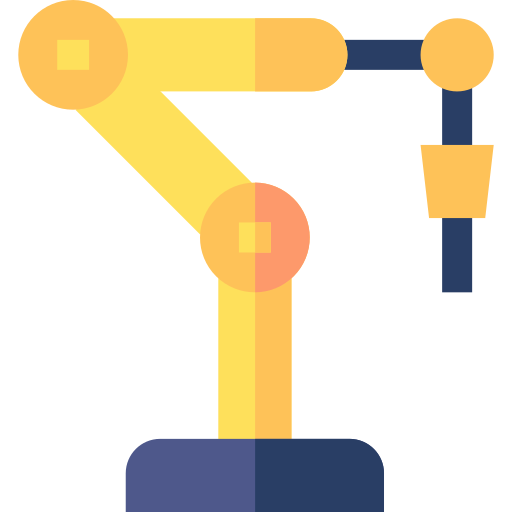
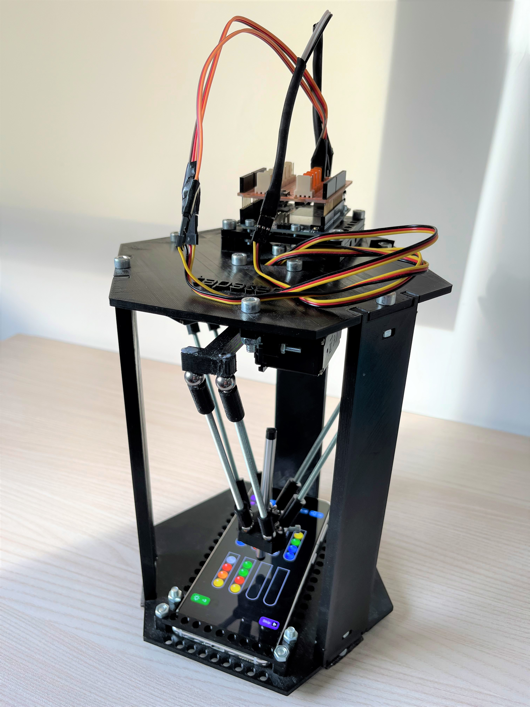

<!-- Improved compatibility of back to top link: See: https://github.com/othneildrew/Best-README-Template/pull/73 -->
<a name="readme-top"></a>
<!--
*** Thanks for checking out the Best-README-Template. If you have a suggestion
*** that would make this better, please fork the repo and create a pull request
*** or simply open an issue with the tag "enhancement".
*** Don't forget to give the project a star!
*** Thanks again! Now go create something AMAZING! :D
-->


<!-- PROJECT SHIELDS -->
<!--
*** I'm using markdown "reference style" links for readability.
*** Reference links are enclosed in brackets [ ] instead of parentheses ( ).
*** See the bottom of this document for the declaration of the reference variables
*** for contributors-url, forks-url, etc. This is an optional, concise syntax you may use.
*** https://www.markdownguide.org/basic-syntax/#reference-style-links
-->
[![Contributors][contributors-shield]][contributors-url]
[![Forks][forks-shield]][forks-url]
[![Stargazers][stars-shield]][stars-url]
[![Issues][issues-shield]][issues-url]
[![MIT License][license-shield]][license-url]


<!-- PROJECT LOGO -->
<br />
<div align="center">
  <a href="https://github.com/DeMaCS-UNICAL/BrainyBot">
    
  </a>

<h3 align="center">BrainyBot</h3>

  <p align="center">
    BrainyBot is a robot capable of solving the Candy Crush Saga and Ball Sort Puzzle video games using touching a phone screen. 
    Based on the great TapsterBot design from Jason Huggins (https://github.com/tapsterbot/tapsterbot, https://tapster.io/)
    <br />
    <a href="https://github.com/DeMaCS-UNICAL/BrainyBot/tree/main/docs/index.md"><strong>Explore the docs »</strong></a>
    <br />
    <br />
    <a href="https://www.youtube.com/watch?v=pgNjBhVs7_4">View Demo</a>
    ·
    <a href="https://github.com/DeMaCS-UNICAL/BrainyBot/issues">Report Bug</a>
    ·
    <a href="https://github.com/DeMaCS-UNICAL/BrainyBot/issues">Request Feature</a>
  </p>

</div>


<!-- TABLE OF CONTENTS -->
<details>
  <summary>Table of Contents</summary>
  <ol>
    <li>
      <a href="#about-the-project">About The Project</a>
      <ul>
        <li><a href="#built-with">Built With</a></li>
      </ul>
    </li>
    <li>
      <a href="#getting-started">Getting Started</a>
      <ul>
        <li><a href="#prerequisites">Prerequisites</a></li>
        <li><a href="#installation">Installation</a></li>
      </ul>
    </li>
    <li><a href="#usage">Usage</a></li>
    <li><a href="#roadmap">Roadmap</a></li>
    <li><a href="#contributing">Contributing</a></li>
    <li><a href="#license">License</a></li>
    <li><a href="#contact">Contact</a></li>
    <li><a href="#acknowledgments">Acknowledgments</a></li>
  </ol>
</details>


<!-- ABOUT THE PROJECT -->
## About The Project

![operating-workflow]
<!-- ![product-screenshot] -->

BrainyBot is a delta robot capable of
playing match-3 games and ball-sorting puzzles by acting on
mobile phones. The robot recognizes objects of different colors
and shapes through a vision module, is capable of making
strategic decisions based on declarative models of the game’s
rules and of the game playing strategy, and features an effector
that execute moves on physical devices.
Our solution integrates multiple AI methods, including vision
processing and answer set programming. Helpful and
reusable infrastructure is provided: the vision task is facilitated,
while robot motion control is inherently simplified by
the usage of a delta robot layout. The figure above shows the 
operating workflow of an instance of a BrainyBot.

<p align="right">(<a href="#readme-top">back to top</a>)</p>

### How it works

The main hardware parts of a BrainyBot are a mobile device PH,
a computer C and the robotic effector E controlled using an Arduino board. 
Software components are placed respectively on PH or on C, 
which in turn controls all the parts of the system. 
A game G of choice runs on PH. BrainyBot cyclically processes information taken
from PH’s display, then decides and executes arm moves on
the touch display itself. More in detail, in each iteration, the
Sense-Think-Act workflow is executed.



### Built With

- Python3
- Javascript (Node.js)
- Answer Set Programming
<p align="right">(<a href="#readme-top">back to top</a>)</p>


<!-- GETTING STARTED -->
## Getting Started
To get a local copy up and running follow these simple example steps.

### Required hardware and software

This is a list of prerequisites for using the project:
* **PH**: an Android mobile phone. This is the device where the ScreenshotServer application is installed and where the game will be played on.
You can find a pre-built apk for the ScreenshotServer in the ScreenshotServer folder. Just push it to PH, install it and start the server. Take note of the value of PH IP address.
* **TP**: an assembled Tapsterbot. This robotic arm can programmatically perform actions on a given touch screen (taps, swipes, etc.)
* **C**: a Linux host. The Linux host will host the Tapsterbot server commanding the robot, will collect screenshots from PH and run the AI module.

* npm: https://docs.npmjs.com/downloading-and-installing-node-js-and-npm 
* pipenv: https://pypi.org/project/pipenv/


### Installation and set up 

You will need to set up some modules which are briefly described next:

## ScreenshotServer

The ScreenshotServer is an Android application which opens an HTTP server on PH. You can manually HTTP GET screenshots on demand from the Screenshotserver this way:

    curl http://<PHone-IP>:5432/?name=requestimage --output screen.png

You can find a pre-built apk for the ScreenshotServer in the ScreenshotServer folder. Just push it to PH, install it and start the server. Take note of the value of PHone-IP.

## Tapsterbot

The robotic arm needs to be 3D-printed and assembled as described in several tutorials online like: https://www.instructables.com/Tapsterbot-20-Servo-Arm-Assembly/.
The software on the embedded Arduino board must be the Standard Firmata script: from the Arduino IDE find and upload the "Firmata" script:

    File -> Open -> Examples > Firmata > StandardFirmata

Calibration and testing of the robot can be done by following the installation guide of the Tappy server: https://github.com/DeMaCS-UNICAL/tappy-original

## Tappy server 

You find a fork of the tappy project under the tappy-server submodule. The Tappy server is expected to run on some system on port 80. The `config.js` file under the `tappy-server` folder allows to customize the listening port and other physical parameters of the robot.
Recall you can use `nvm` for managing the required node.js version, (currently it is needed node 16.*).
If your current user has no access rights to serial ports, recall to use `sudo npm start` when starting the tappy server instead of a plain `npm start`, and ensure the correct version of node is available also under sudo privileges (the default node might differ when sudo-ing).

## Python client

This python client for controlling tappy server from a client is located under the `tappy-client/clients/python` folder. You will possibly need to tweak IP and listening port of the Tappy server and other stuff in the `config3.py` file. Example usage:

    python3 client3.py --url http://127.0.0.1 --light 'swipe 325 821 540 821'

Detailed documentation for the python client can be found in the README of the https://github.com/DeMaCS-UNICAL/tapsterbot-original

## Basic installation instructions

1. Clone the repo
   ```sh
   git clone https://github.com/DeMaCS-UNICAL/BrainyBot.git
   ```
2. Don't forget to pull submodules
   ```sh
   git submodule update --init --recursive
   ```
3. If needed, keep submodules up to date
    ```sh
   git pull --recurse-submodules
   ```
4. Set up a pipenv environment after cd-ing in BrainyBot/Brain. The command will download all required libraries in a new virtual environment:
    ```sh
    cd BrainyBot/Brain
    pipenv install
   ```
   We assume you have either Python 3.9 or 3.10 on C (Python 3.8 and 3.7 should work too).
   
8. Move to the `BrainyBot/tappy-server` folder and 
install the server contained in that folder (tested with node.js lts/gallium (16.13.2)):
    ```sh
    npm install
   ```
   For more information check the submodule repository: 
   https://github.com/DeMaCS-UNICAL/tappy-original/

<p align="right">(<a href="#readme-top">back to top</a>)</p>


<!-- USAGE EXAMPLES -->
## Usage
These are the steps to follow to use and make the project work properly:

1. Open two terminal windows, T1 and T2.

2. Ensure the robot is connected via USB to C, and on T1 navigate to the `tappy-server` folder 
and issue the following command:
   ```sh
    sudo npm start
   ```
   Write down the IP and port address of the Linux host server C.
   You can also perform PH display calibration at this point.
   For more information check the official repository for the Tappy Server Module: 
   https://github.com/DeMaCS-UNICAL/tappy-original/

3. Run the ScreenshotServer application on PH, and tap its start button. 
Write down the IP address of PH. 

4. Change the IP addresses of the ScreenshotServer and the 
tappy-server in the `constant.py` file contained in 
the folder `Brain/AI/src`

5. Open the Candy Crush Saga or Ball Sort Puzzle game on the PH 
and start a game on a level of choice. Unlike Candy Crush Saga, 
there are different implementations of the Ball Sort Puzzle game. 
BrainyBot is tested on 
[Ball Sort - Color Sorting Game](https://play.google.com/store/apps/details?id=ball.sort.water.color.hoop.stack.puzzle&hl=it&gl=US)  

6. In T2, navigate to the `Brain` folder.
You can run the AI either by first activating a pipenv shell
 ```sh
 cd Brain
 pipenv shell
 ```
and then issuing
```sh
python3 AI/src/main.py -g game_name
```
Alternatively, you can just cd to the `Brain` folder and issue
```sh
pipenv run play -g game_name
```
`-g/--game` can be followed by:
   * `ball_sort` if you want to run the AI module related to the ball sort puzzle game
   * `candy_crush` if you want to run the AI module related to the candy crush game
   
   For example:
   ```sh
   python3 main.py -g ball_sort
   ```

   This will take a screenshot, then perform computer vision
   and decision making on it. The results of this process, 
   i.e. the coordinates (x, y) representing the moves to be 
   performed on the PH, are automatically communicated by a 
   python client to the tappy-server, which in turn 
   will command the robotic effector E who will execute
   the moves on PH.
   
   The ball_sort AI will execute a whole level, while the candy_crush AI will decide and execute one move at a time.

For more examples, please refer to the [Documentation](https://github.com/DeMaCS-UNICAL/BrainyBot/tree/main/docs/index.md)

<p align="right">(<a href="#readme-top">back to top</a>)</p>


<!-- CONTRIBUTING -->
## Contributing

If you have a suggestion that would make this better, please fork the repo and create a pull request. You can also simply open an issue with the tag "enhancement".
Don't forget to give the project a star! Thanks again!

Also, if you want to add your favorite game to the project, the steps to follow are these:

1. Fork the Project
2. Create your Game Branch (`git checkout -b yourGame`)
3. Commit your Changes (`git commit -m 'Add some AmazingFeature'`)
4. Push to the Branch (`git push origin yourGame`)
5. Open a Pull Request

The code to modify for adding a new game is roughly the following:
1. Create your own package renaming it with the name of your game 
and add it in the `AI/src` folder. In this main package 
add some subpackages trying to keep the current structure 
of the project:
   * A package renamed `detect` for analyzing game screenshots 
   using your favorite computer vision algorithms
   * A package `abstract`  to translate 
   the information extrapolated from the analysis of the 
   screenshot into python objects representing the entities 
   of the game
   * A package renamed `dlvsolution` for translating python 
   objects into logical predicates and for finding a game 
   solution through ASP and the EmbASP framework
   * A package renamed `resources` in which to insert the 
   sprites to be used for the analysis of the screenshot 
   (if necessary) and the ASP encoding for the resolution 
   of the game
   * A `constant.py` script where you specify the path to the various 
   elements you need in the code
   * A `helper.py` script in which you call the methods of 
   your objects in the right order in order to find the solution
   to the game. Finally in this script the identified moves 
   to be performed to solve the game are communicated to 
   the tappy-server

2. In the `AI/src/main.py` script add an argument to be used 
at runtime to choose the game you have added and the code to 
conveniently call the main method present in your 
`AI/src/yourGame/helper.py` script. For example:
   ```sh
   python3 main.py -g yourGame
   ```

<p align="right">(<a href="#readme-top">back to top</a>)</p>


<!-- LICENSE -->
## License

Distributed under the APACHE-2.0 License. See `LICENSE.txt` for more information.

<p align="right">(<a href="#readme-top">back to top</a>)</p>


<!-- CONTACT -->
# The team

- General integration of modules, Hardware, Calibration, Actuation modules, AI Tweaking, whatever other kick is needed to keep everything alive and working: Giovambattista Ianni a.k.a. Agelin Bee ([@iannigb](https://github.com/iannigb))
- Screenshotserver, Candy Crush Vision & Candy Crush AI : Mario Avolio ([@MarioAvolio](https://github.com/MarioAvolio)) [@linkedin](https://www.linkedin.com/in/MarioAvolio/) - marioavolio@protonmail.com
- Ball Sort Vision & Ball Sort AI : Giovanni Beraldi - [@linkedin](https://www.linkedin.com/in/GiovanniBeraldi/) - gvnberaldi@gmail.com
- General Maintainance & Bug fixing : Denise Angilica ([@deniseAngilica](https://github.com/deniseAngilica)) and Francesco Pacenza ([@fpacenza](https://github.com/fpacenza)) 


<p align="right">(<a href="#readme-top">back to top</a>)</p>


<!-- MARKDOWN LINKS & IMAGES -->
<!-- https://www.markdownguide.org/basic-syntax/#reference-style-links -->
[contributors-shield]: https://img.shields.io/github/contributors/DeMaCS-UNICAL/BrainyBot.svg?style=for-the-badge
[contributors-url]: https://github.com/DeMaCS-UNICAL/BrainyBot/graphs/contributors
[forks-shield]: https://img.shields.io/github/forks/DeMaCS-UNICAL/BrainyBot.svg?style=for-the-badge
[forks-url]: https://github.com/DeMaCS-UNICAL/BrainyBot/network/members
[stars-shield]: https://img.shields.io/github/stars/DeMaCS-UNICAL/BrainyBot.svg?style=for-the-badge
[stars-url]: https://github.com/DeMaCS-UNICAL/BrainyBot/stargazers
[issues-shield]: https://img.shields.io/github/issues/DeMaCS-UNICAL/BrainyBot.svg?style=for-the-badge
[issues-url]: https://github.com/DeMaCS-UNICAL/BrainyBot/issues
[license-shield]: https://img.shields.io/github/license/DeMaCS-UNICAL/BrainyBot.svg?style=for-the-badge
[license-url]: https://github.com/DeMaCS-UNICAL/BrainyBot/blob/master/LICENSE.txt
[linkedin-shield]: https://img.shields.io/badge/-LinkedIn-black.svg?style=for-the-badge&logo=linkedin&colorB=555
[linkedin-url]: https://linkedin.com/in/linkedin_username
[product-screenshot]: images/BrainyBot.jpg
[operating-workflow]: images/Sense-Think-Act.png
[Next.js]: https://img.shields.io/badge/next.js-000000?style=for-the-badge&logo=nextdotjs&logoColor=white
[Next-url]: https://nextjs.org/
[React.js]: https://img.shields.io/badge/React-20232A?style=for-the-badge&logo=react&logoColor=61DAFB
[React-url]: https://reactjs.org/
[Vue.js]: https://img.shields.io/badge/Vue.js-35495E?style=for-the-badge&logo=vuedotjs&logoColor=4FC08D
[Vue-url]: https://vuejs.org/
[Angular.io]: https://img.shields.io/badge/Angular-DD0031?style=for-the-badge&logo=angular&logoColor=white
[Angular-url]: https://angular.io/
[Svelte.dev]: https://img.shields.io/badge/Svelte-4A4A55?style=for-the-badge&logo=svelte&logoColor=FF3E00
[Svelte-url]: https://svelte.dev/
[Laravel.com]: https://img.shields.io/badge/Laravel-FF2D20?style=for-the-badge&logo=laravel&logoColor=white
[Laravel-url]: https://laravel.com
[Bootstrap.com]: https://img.shields.io/badge/Bootstrap-563D7C?style=for-the-badge&logo=bootstrap&logoColor=white
[Bootstrap-url]: https://getbootstrap.com
[JQuery.com]: https://img.shields.io/badge/jQuery-0769AD?style=for-the-badge&logo=jquery&logoColor=white
[JQuery-url]: https://jquery.com 
